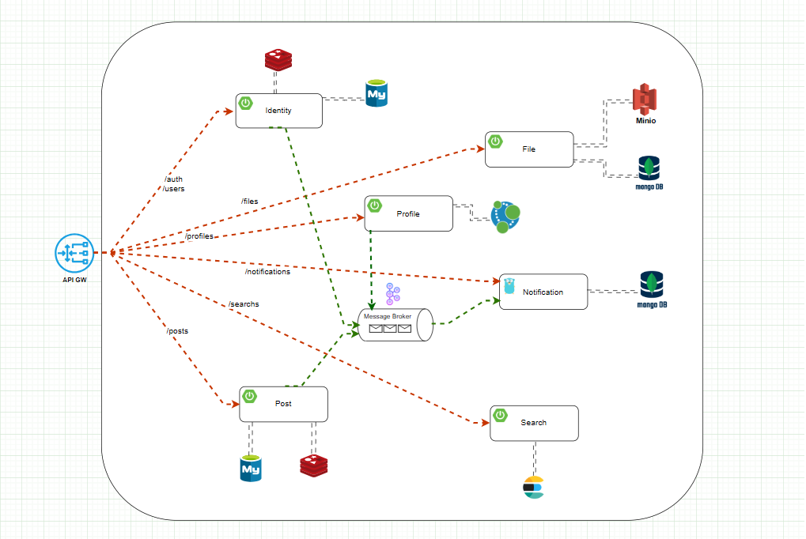

<h1 align="center">Insta Up</h1>
<p align="center">
    The Social Network simple
</p>



<a name="table-of-contents"></a>

## Table of contents
-   [Table of contents](#table-of-contents)
-   [Description](#description)
-   [Installation](#installation)
    -   [Requirements](#requirements)
    -   [Clone the project](#clone-the-project)
    -   [Build from source](#build-from-source)
-   [Usage](#usage)
    -   [Running server](#running-server)
    -   [Running client](#running-client)
-   [Config](#config)

-   [TODO](#todo)


<a name="description"></a>

## Description
Insta Up is a social network that allows users to share photos and videos, follow other users, like and comment on posts, and send direct messages.

<a name="installation"></a>

## Installation

### Requirements

### Clone the project

```bash
git clone https://github.com/upinmcSE/InstaUp.git
```

### Build from source

```bash
cd InstaUp
docker compose build
```

<a name="usage"></a>

## Usage

### Running server

```bash
docker compose up -d
```

### Running client

```bash
cd InstaUp/web
npm install
npm run dev
```

<a name="config"></a>
## Config

<a name="todo"></a>
## TODO
